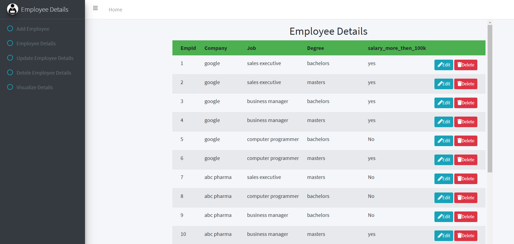

# EmployeeDetails

### This is an application which performs CRUD operations on EmployeeDetails through GUI

#### Technology requirements
- NodeJS
- EJS
- AdminLTE(bootstrap)
- MongoDB

#### Package requirements
- npm install ejs [ejs-ref](https://www.npmjs.com/package/ejs)
- npm install express [express-ref](https://www.npmjs.com/package/express)
- npm install mongodb [mongodb-ref](https://www.npmjs.com/package/mongodb)
- npm install nodemon [nodemon-ref](https://www.npmjs.com/package/nodemon)

#### Images of the application
- **Slide**
  > This is the starting page when you request the server.
  > It shows the list of employeedetails.
  
- **Slide2**
  > You can add new Employee by going to Add Employee Section.
  > Here it shows a form with different field to be filled.
  
- **Slide33**
  > Even you can update the exisiting employee by entering the EmpId. 
  
- **Slide4**
  > You can delete the exisiting employee by providing the EmpId.
  

